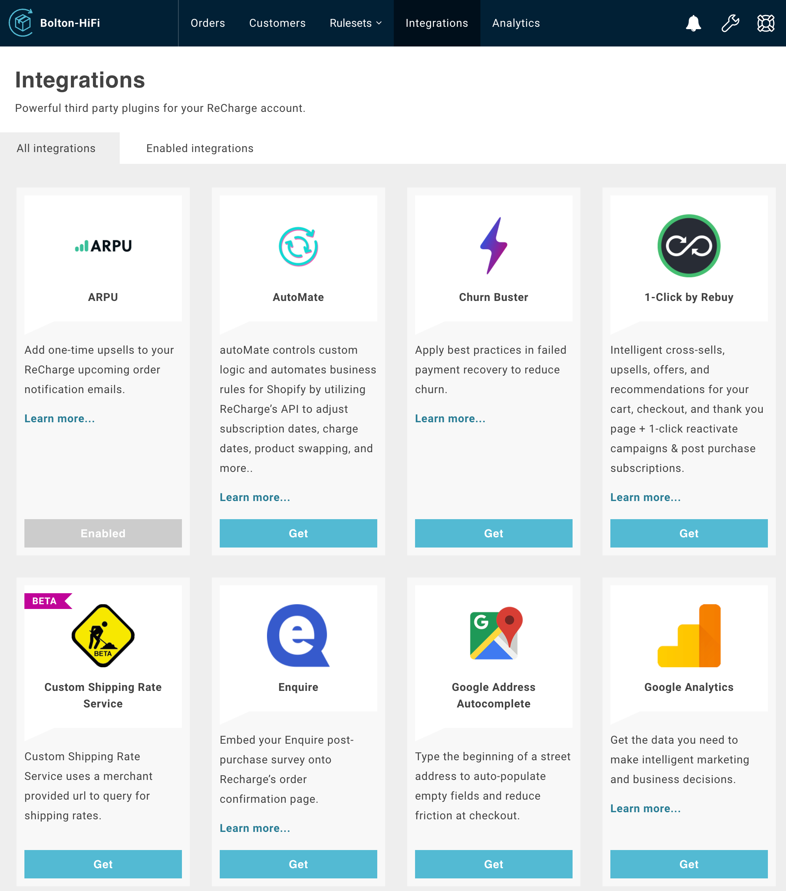
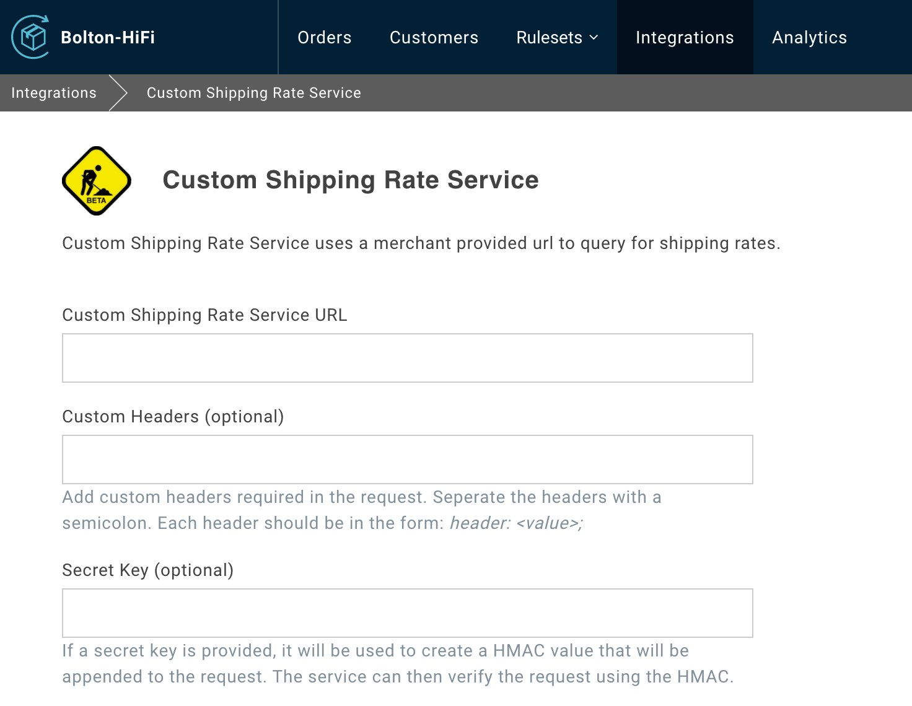
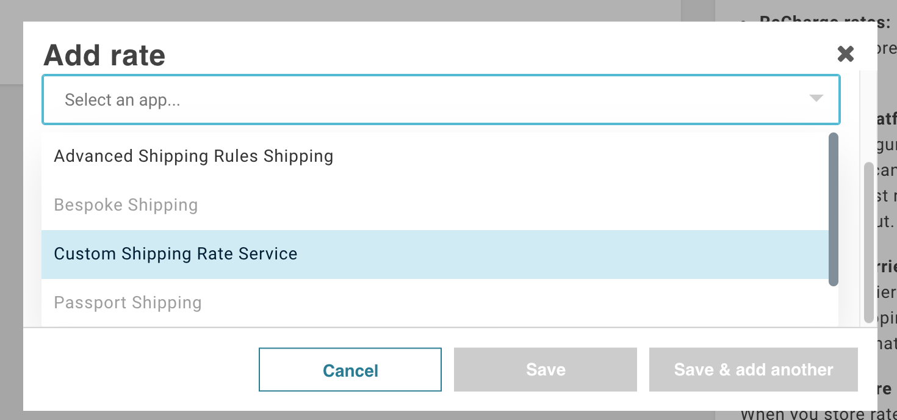

# Custom Shipping Rate Service Integration

You can integrate a custom shipping service with ReCharge to let shoppers use their preferred shipping carrier.

## Prerequisites
Contact your account manager to enable the Custom Shipping Rate Service beta on your store.

## Setup

1. Go to the **Integrations** page and navigate to **All Integrations**

3. Select **Get** under **Custom Shipping Rate Service**

4. Fill in the **URL** and **Header** fields: 

- **Custom Shipping Rate Service URL (required)** - This is the https url of your custom shipping rate service endpoint
- **Custom Headers (optional)** - Add any headers here that your service requires
- **Secret Key (optional)** - If your service requires a secret key, provide that here

## Use custom shipping service in a shipping zone

1. Go to [Shipping Settings](https://support.rechargepayments.com/hc/en-us/articles/360008830553-Setting-up-shipping-for-subscription-products)

2. Under **Shipping Setup**, select the **Use ReCharge Zones, Rates adn Integrations (Advanced)**, and follow the prompts.  Once complete, proceed to the next step.

3. Navigate to **Manage Zones** and and add a rate to an existing zone (or create a zone if necessary).

4. Select **Use a third-party app to calculate rates** then select **Custom Shipping Rate Service**

5. Save your changes.

